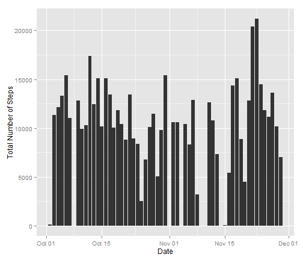
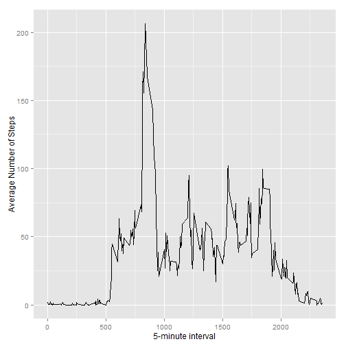
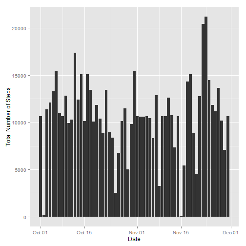
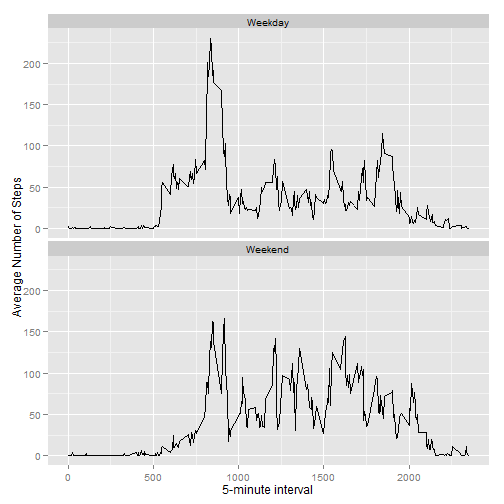

Reproducible Research - Peer Assessment1 
========================================================

```r
# Loading R package
library(ggplot2) 
```
## Loading and preprocessing the data
Extra transformation is made in order to ensure better quality of result set.


```r
unzip("activity.zip")
data <- read.csv("activity.csv", header = TRUE, sep ="," , colClass=c("numeric", "character", "numeric"))
data$date <- as.Date(data$date, format="%Y-%m-%d")


#Return samples of dataset
str(data)
```

```
## 'data.frame':	17568 obs. of  3 variables:
##  $ steps   : num  NA NA NA NA NA NA NA NA NA NA ...
##  $ date    : Date, format: "2012-10-01" "2012-10-01" ...
##  $ interval: num  0 5 10 15 20 25 30 35 40 45 ...
```

```r
summary(data)
```

```
##      steps             date               interval     
##  Min.   :  0.00   Min.   :2012-10-01   Min.   :   0.0  
##  1st Qu.:  0.00   1st Qu.:2012-10-16   1st Qu.: 588.8  
##  Median :  0.00   Median :2012-10-31   Median :1177.5  
##  Mean   : 37.38   Mean   :2012-10-31   Mean   :1177.5  
##  3rd Qu.: 12.00   3rd Qu.:2012-11-15   3rd Qu.:1766.2  
##  Max.   :806.00   Max.   :2012-11-30   Max.   :2355.0  
##  NA's   :2304
```

## What is mean total number of steps taken per day?

```r
#Make a subset, removing NA and aggregate steps by date
steps_date <- aggregate(formula = steps~date, data = data, FUN = sum, na.rm=TRUE)
```
### 1. Make a histogram of the total number of steps taken each day

```r
#Then plot
qplot(
        x=date,
        y=steps,
        data=steps_date,
        stat="identity",
        geom="bar",
        ylab ="Total Number of Steps", 
        xlab="Date"       
        )
```

 


### 2. Calculate and report the mean and median total number of steps taken per day

```r
mean_by_date <- round(mean(steps_date$steps), 2)
mean_by_date
```

```
## [1] 10766.19
```

```r
median_by_date <- round(median(steps_date$steps), 2)
median_by_date
```

```
## [1] 10765
```
The mean total number of steps taken per day is 1.076619 &times; 10<sup>4</sup>, while the median is 1.0765 &times; 10<sup>4</sup>

## What is the average daily activity pattern?

```r
#Make a subset, removing NA and aggregate step by interval
step_interval <- aggregate(formula = steps ~ interval, data = data, FUN = mean, na.rm=TRUE)
summary(step_interval )
```

```
##     interval          steps        
##  Min.   :   0.0   Min.   :  0.000  
##  1st Qu.: 588.8   1st Qu.:  2.486  
##  Median :1177.5   Median : 34.113  
##  Mean   :1177.5   Mean   : 37.383  
##  3rd Qu.:1766.2   3rd Qu.: 52.835  
##  Max.   :2355.0   Max.   :206.170
```


### 1. Make a time series plot (i.e. type = "l") of the 5-minute interval (x-axis) and the average number of steps taken, averaged across all days (y-axis)

```r
qplot(
        x=interval,
        y=steps,
        data=step_interval,
        stat="identity",
        geom="line",
        ylab ="Average Number of Steps", 
        xlab="5-minute interval"       
)
```

 
### 2. Which 5-minute interval, on average across all the days in the dataset, contains the maximum number of steps?

```r
interval_max_step <- step_interval[which.max(step_interval$steps),]$interval
interval_max_step
```

```
## [1] 835
```
It is the 835th steps.

## Imputing missing values

### 1. Total number of missing values in the dataset

```r
sum(!complete.cases(data))
```

```
## [1] 2304
```

```r
##Missing steps
sum(is.na(data$steps))
```

```
## [1] 2304
```

```r
##Missing date
dates_in_range <- seq.Date(from = min(data$date),
                           to = max(data$date),
                           by='1 day')
sum(!data$date[complete.cases(data)] %in% dates_in_range)
```

```
## [1] 0
```

The total number of missing values for column Steps is 2304 and 0 for column date.

### 2. Devise a strategy for filling in all of the missing values in the dataset.
To populate the missing value, we chose to use the mean value at the same interval level across day.


### 3. Create a new dataset that is equal to the original dataset but with the missing data filled in.

```r
###Round steps in dataset step_interval to avoir fractional steps. 
step_interval$round_steps <- floor(step_interval$steps)

###Merge orignial dataset with step_interval dataset(mean by interval) by interval
merged <- merge(data, step_interval[,c('interval', 'round_steps')], by='interval')

###Replace missing value
merged$steps <- ifelse(is.na(merged$steps),
                       merged$round_steps,
                       merged$steps)
###Remove extra column
merged$round_steps <- NULL

summary(merged)
```

```
##     interval          steps             date           
##  Min.   :   0.0   Min.   :  0.00   Min.   :2012-10-01  
##  1st Qu.: 588.8   1st Qu.:  0.00   1st Qu.:2012-10-16  
##  Median :1177.5   Median :  0.00   Median :2012-10-31  
##  Mean   :1177.5   Mean   : 37.33   Mean   :2012-10-31  
##  3rd Qu.:1766.2   3rd Qu.: 27.00   3rd Qu.:2012-11-15  
##  Max.   :2355.0   Max.   :806.00   Max.   :2012-11-30
```

No more NA values.

### 4. Make a histogram of the total number of steps taken each day and Calculate and report the mean and median total number of steps taken per day.


```r
steps_date_n <- aggregate(steps ~ date, data = merged, FUN = sum)
qplot(
        x=date,
        y=steps,
        data=steps_date_n,
        stat="identity",
        geom="bar",
        ylab ="Total Number of Steps", 
        xlab="Date"       
)
```

 

```r
mean_by_date_n <- round(mean(steps_date_n$steps), 2)
mean_by_date_n
```

```
## [1] 10749.77
```

```r
median_by_date_n <- round(median(steps_date_n$steps), 2)
median_by_date_n
```

```
## [1] 10641
```

After filling the missing values, the mean total number of steps taken per day is 1.074977 &times; 10<sup>4</sup>, while the median is 1.0641 &times; 10<sup>4</sup>. The impact is quite small.

## Are there differences in activity patterns between weekdays and weekends?

### 1.Create a new factor variable in the dataset with two levels – “weekday” and “weekend” indicating whether a given date is a weekday or weekend day.

```r
#Create a function
factor_w <- function(date)
{
        if(weekdays(date) %in% c("Saturday", "Sunday")) {"Weekend"}
        else {"Weekday"}
}

merged$type <- as.factor(sapply(merged$date, factor_w))
```

### 2.Make a panel plot containing a time series plot (i.e. type = "l") of the 5-minute interval (x-axis) and the average number of steps taken, averaged across all weekday days or weekend days (y-axis).

```r
qplot(
        x=interval,
        y=steps,
        data=merged,
        
        stat="summary",
        fun.y = "mean",
        geom="line",
        ylab ="Average Number of Steps", 
        xlab="5-minute interval"        
) + facet_wrap (~type, nrow=2, ncol=1)
```

 

